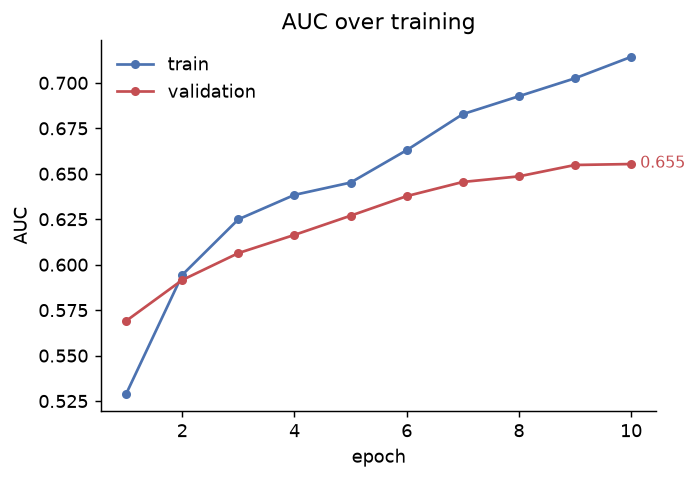
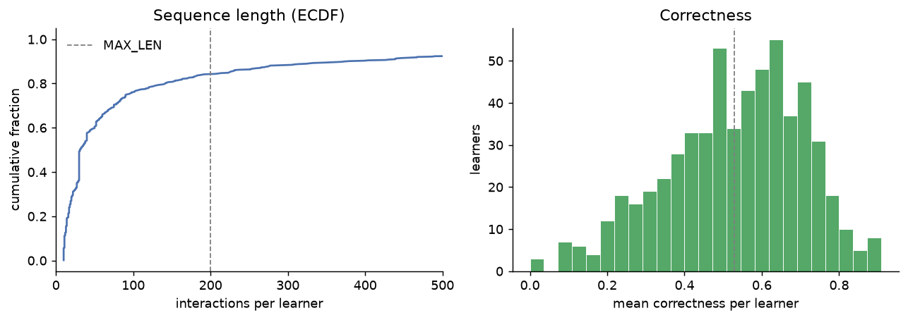

# Deep Knowledge Tracing on EdNet-KT1

A sequential deep-learning baseline for knowledge tracing: an LSTM that, at each
step of a learner's question-answering history, predicts the probability of a
correct response to the next question.

Built on [EdNet-KT1](https://github.com/riiid/ednet), the question-response logs
from Santa, a TOEIC tutoring service (~780k learners). The model follows
Piech et al. (2015).

## Results



Validation AUC reaches ~0.66 over held-out learners, within the range reported
for DKT on EdNet-KT1 subsamples. Validation tracks train with a small gap and no
upturn in validation loss, so there is no sign of overfitting at this sequence
length.

## Data



Sequence lengths are right-skewed: most learners have short histories, with a
long tail of heavy users. The ECDF is already near 1.0 where it crosses
`MAX_LEN = 200`, so truncation affects few learners. Per-learner correctness
centers near the dataset mean.

## Pipeline

Two notebooks, run in order:

- `01_data_prep.ipynb` — raw KT1 logs to per-learner sequences
- `02_train.ipynb` — LSTM training and evaluation

### Leakage handling

Two risks set the order of operations:

- **Learner leakage.** The split is on `user_id`, so each learner's full history
  sits entirely in train or validation. The evaluation question is generalization
  to unseen learners, not to held-out interactions from learners already trained on.
- **Encoder leakage.** The skill vocabulary is fit on training learners only.
  Skills appearing solely in validation map to an `UNK` index, matching the
  out-of-vocabulary case at inference.

Anything data-derived (the vocabulary) is fit after the split. Row-local steps
(correctness) run before it.

### Preprocessing

Correctness is computed per interaction as `submitted == key`. Interactions with
a null answer or null key are dropped rather than scored incorrect. Untagged
items (`tags = -1`) are dropped so they do not enter the vocabulary as a skill.
Each question's first skill tag is taken as its knowledge component.

### Model

Each input step encodes (skill, correctness) as a single integer; an embedding
feeds a single-layer LSTM, and a linear head projects to one logit per skill.
Inputs span positions `0…T-1` and targets `1…T`, so the answer being predicted
never enters the input at the same step. Loss is masked binary cross-entropy;
AUC is computed over non-padded positions.

## Setup

```bash
python -m venv .venv && source .venv/bin/activate
pip install -r requirements.txt
```

Download [EdNet-KT1](https://github.com/riiid/ednet) and the Contents table.
Place them at:

```
data/raw/KT1/            # per-learner CSVs
data/raw/contents/       # questions.csv (answer key + tags)
```

Then run `01_data_prep.ipynb` followed by `02_train.ipynb`. Prep writes
`train.parquet`, `val.parquet`, and `meta.json` to `data/processed/`; training
reads only those.

## Reference

Piech et al. (2015), *Deep Knowledge Tracing*. NeurIPS.